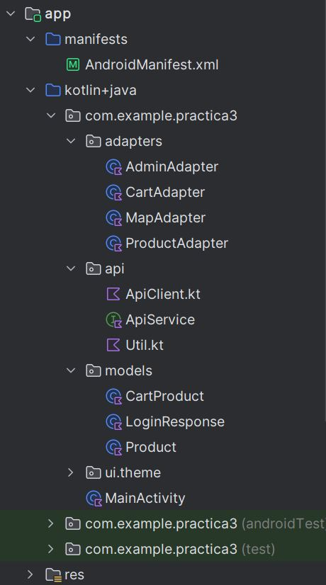
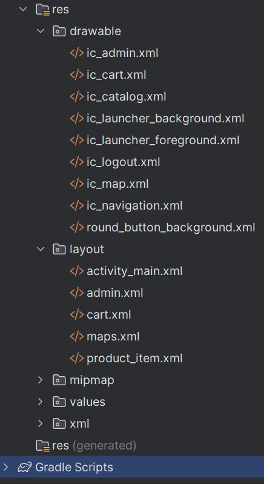

# Práctica 3: App para acceder a un catálogo de productos basado en una API RESTful

Desarrollo de una aplicación de Android para acceder a un catálogo y carrito de productos,
basado en la app web RESTful de la práctica 1.

## Autores

| Nombre          | Usuario                |
|------------------|--------------------|
| Marina Jun Carranza Sánchez | [marinajcs](https://github.com/marinajcs) |
| Mario Martínez Sánchez | [martinezmario02](https://github.com/martinezmario02) |

## 1. Instrucciones de instalación y ejecución de la app

Para ejecutar la aplicación Android, se usará un emulador en Android Studio. Para ello, primero
se abre el AVD Manager y se configura un emulador (se ha usado en el desarrollo un Galaxy Nexus
con API 33) si no se tiene ya creado. Después, se inicia el emulador, y se ejecuta la aplicación
haciendo click el botón Run 'MainActivity' (Mayús+F10), que la compilará y ejecutará.

Esto permitirá instalar la app en el emulador, y hacer que se abra directamente, permitiendo
interactuar con ella y realizar pruebas en el entorno simulado.

## 2. Dependencias usadas (Retrofit, Gson, Google Maps API)

* `com.squareup.okhttp3:logging-interceptor:4.11.0`: permite registrar las solicitudes y respuestas
HTTP para depuración de las interacciones con la API.

* `com.squareup.okhttp3:okhttp:4.11.0`: Biblioteca HTTP para realizar solicitudes a servidores, utilizada
para la comunicación con APIs.

* `com.squareup.retrofit2:retrofit:2.9.0`: Framework para simplificar las solicitudes HTTP al crear una
interfaz para consumir APIs RESTful.

* `com.squareup.retrofit2:converter-gson:2.9.0`: Conversor que integra Retrofit con Gson para serializar
y deserializar JSON automáticamente.

* `com.google.code.gson:gson:2.8.8`: Biblioteca para manejar JSON, útil para convertir objetos de Java a
JSON y viceversa.

* `androidx.appcompat:appcompat:1.3.1`: Proporciona compatibilidad hacia atrás para funciones modernas de
UI en versiones antiguas de Android.

* `androidx.core:core-ktx:1.7.0`: Extensiones para facilitar el desarrollo en Kotlin al interactuar con el
framework de Android.

* `androidx.recyclerview:recyclerview:1.2.1`: Componente UI para mostrar listas y rejillas de productos en
el catálogo o carrito de manera eficiente.

* `org.osmdroid:osmdroid-android:6.1.14`: Biblioteca de mapas para mostrar ubicaciones de tiendas o puntos de
interés relacionados con el catálogo o carrito.

## 3. Descripción de la estructura de carpetas y organización del código

Los ficheros más importantes son el `AndroidManifest.xml`, el `MainActivity.kt`, las clases adaptadores
y los layout para las vistas.

### 3.1. Estructura principal de paquetes y código

### 3.2. Estructura con la carpeta `res` desplegada

## 4. Lista de endpoints API utilizados y su descripción

Se han declarado los endpoints en tres Rest Controllers distintos, cada uno asociado a una funcionalidad
de la app concreta:

### 4.1. CartRestController (Gestión del carrito)

1. `GET /api/cart`: devuelve todos los productos en el carrito del usuario autenticado con sus respectivas cantidades.

2. `GET /api/cart/total`: calcula y devuelve el precio total de los productos en el carrito del usuario autenticado.

3. `POST /api/cart/add`: añade un producto al carrito del usuario autenticado especificando su productId.

4. `POST /api/cart/delete`: elimina un producto específico del carrito del usuario autenticado usando su productId.

5. `GET /api/cart/bill`: genera y descarga una factura PDF de los productos del carrito del usuario autenticado, y limpia el carrito.

### 4.2. LoginRestController (Autenticación y sesión)

1. `POST /api/auth/login`: permite al usuario iniciar sesión proporcionando username y password. Devuelve un mensaje y el rol del usuario en caso de éxito, o un error en caso de credenciales inválidas.

2. `POST /api/auth/logout`: cierra la sesión del usuario, limpia el contexto de seguridad y finaliza la sesión HTTP.

### 4.3. ProductRestController (Gestión de productos)

1. `GET /api/products`: devuelve una lista de todos los productos disponibles.

2. `POST /api/products/add`: añade un nuevo producto especificando su name y price.

3. `POST /api/products/edit`: edita un producto existente identificándolo por su productId y actualizando su name y price.

4. `POST /api/products/delete`: elimina un producto específico usando su productId.

5. `GET /api/products/databaseExport`: exporta la base de datos a un archivo SQL descargable.

Para más información, así como capturas de la app, se puede consultar tanto el manual de usuario
como el documento de pruebas.
